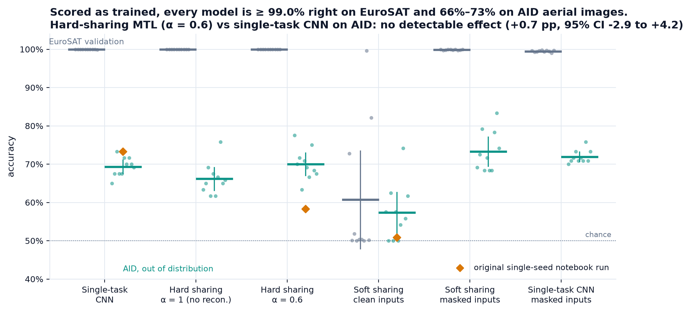
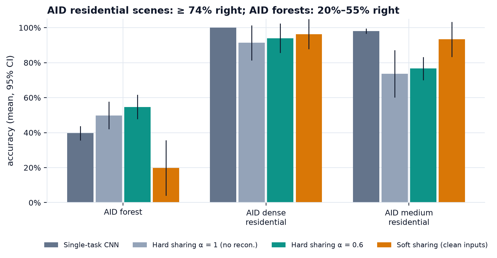
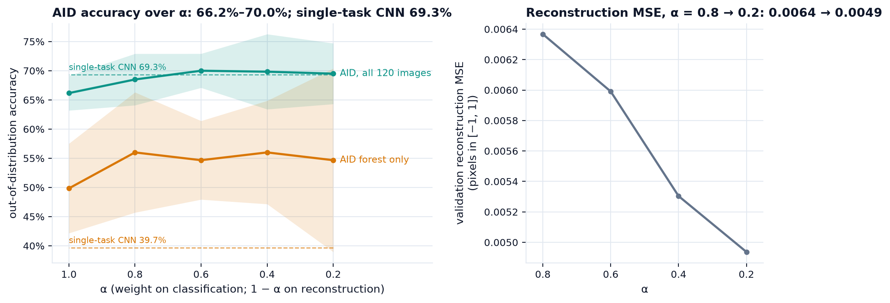
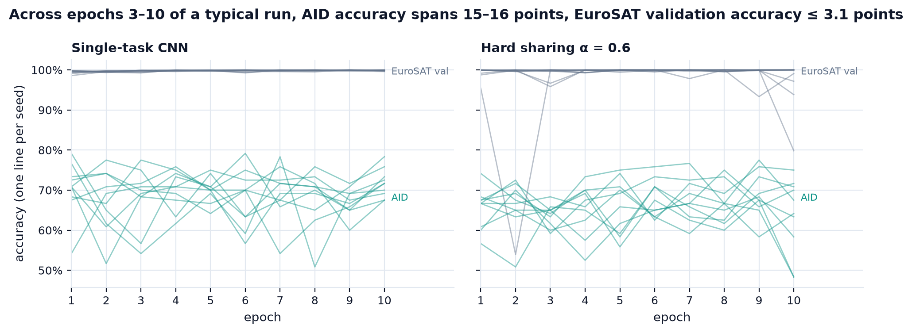
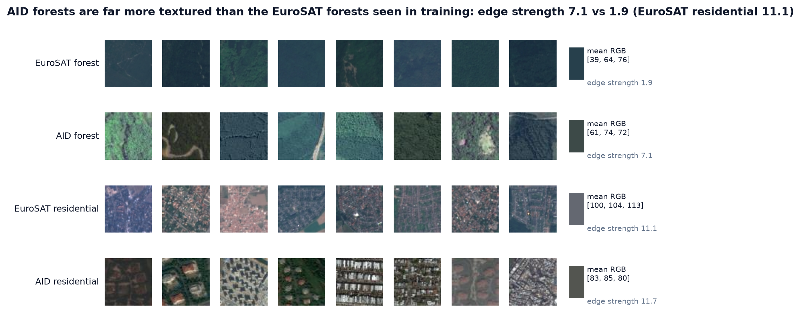

# MTL_Classification_Reconstruction

Does adding a reconstruction task make a satellite-image classifier robust to a new sensor? Over 10 seeds and an out-of-distribution test set, not for accuracy: hard-sharing MTL lands where a single-task CNN already was, and soft sharing's accuracy gain is matched by input masking alone. Only soft sharing's ranking (AUROC) improves, for reasons this design cannot isolate.

[](https://github.com/Pchambet/MTL_Classification_Reconstruction/actions/workflows/ci.yml)

[](LICENSE)
[](https://pchambet.github.io/MTL_Classification_Reconstruction/)



## TL;DR

- **The in-distribution task is saturated.** Scored on the inputs it was trained on, every model reaches ≥ 99.0% on EuroSAT validation, on every seed. Validation accuracy cannot tell the models apart.
- **On AID aerial images, hard-sharing MTL does not beat the single-task CNN:** 70.0% vs 69.3% accuracy, a paired difference of **+0.7 pp (95% CI −2.9 to +4.2, p = 0.68)**. With the architecture held fixed, the reconstruction loss appears to add +3.8 pp (p = 0.02), about what the hard-sharing architecture loses on its own against the CNN (−3.2 pp, p = 0.02). MTL also seems to rank worse (AUROC −0.053, p = 0.005). None of these three effects is significant after correcting for 14 comparisons.
- **Masking alone matches soft sharing's accuracy.** A single-task CNN trained on the same 30%-masked inputs reaches 71.9% against soft sharing's 73.3% (+1.4 pp, CI −2.3 to +5.2, p = 0.41). Trained on masked inputs and scored on clean ones, that CNN gets 74.3% on AID, the best mean AID accuracy of any model.
- **Soft sharing ranks better, for reasons this design cannot isolate.** Its AID AUROC is 0.89 against 0.81 for the masked-input CNN (+0.078, CI +0.056 to +0.100, p < 0.001), which survives the Bonferroni correction. It also has 15× more parameters, so capacity and reconstruction are confounded.
- **The original single-seed comparison was noise.** The course notebook ranked CNN 73.3% > MTL 58.3% > soft sharing 50.8%. Its checkpointing bug restored the last epoch, and last-epoch AID accuracy across seeds spans 67.5–78.3% for the CNN, 48.3–75.0% for MTL and 50.0–68.3% for soft sharing on clean inputs: all three notebook numbers fall inside. Within a typical run, AID accuracy moves 15–16 points between epochs 3 and 10.

## Why it matters

A reconstruction head is often presented as a free regulariser: keep the whole image in the shared encoder and the classifier should rely less on sensor-specific shortcuts. That claim decides whether to spend effort on a decoder and a loss weight α, or on augmentation and a few labelled images from the target domain. On this shift (Sentinel-2 to Google Earth imagery), the decoder did not pay for itself. A cheap input-masking augmentation did at least as well. A single training run could not have shown either result.

## Approach

1. **Data.** We train on 6,000 EuroSAT RGB patches (Sentinel-2, 64×64): 3,000 forest and 3,000 residential, with a stratified 80/20 split drawn per seed. We test out of distribution on 120 [AID](https://captain-whu.github.io/AID/) Google Earth images resized to 64×64: 60 forest, 30 dense residential and 30 medium residential. AID is never used for training or checkpoint selection.
2. **Models.** The three architectures come from the course notebooks:
   - a 24k-parameter single-task CNN;
   - a 193k-parameter hard-sharing network (shared encoder, classifier, decoder) trained on α·CE + (1 − α)·MSE;
   - a 360k-parameter soft-sharing network (two branches tied by an alignment loss, masked-autoencoder reconstruction on inputs with 30% of pixels zeroed).
3. **Controls.** Two controls isolate the effect of reconstruction:
   - hard sharing with **α = 1** (same architecture, decoder unused) separates the auxiliary loss from the different architecture. That architecture is deeper, uses BatchNorm and has 94k parameters on its classification path, about 4× the CNN; the decoder, unused at α = 1, holds the rest of the 193k;
   - a **single-task CNN trained on the same masked inputs** separates soft sharing from its masking.
4. **Protocol.** Each model trains for 10 epochs of Adam (lr 10⁻³, batch 32). We keep the checkpoint with the lowest validation loss. The headline variants run on 10 seeds and the rest of the α sweep (0.8, 0.4, 0.2) on 5, for 65 runs in total. Each seed fixes the split, the initialisation and the masks. Differences are paired by seed and reported with a t interval.
5. **Report.** Every number in this README and in the [report](https://pchambet.github.io/MTL_Classification_Reconstruction/) is computed from `results/` (`results/summary.json`, `results/facts.json`).

## Results

| model (inputs it is scored on) | parameters | EuroSAT val acc | AID acc [95% CI] | AID AUROC | AID forest acc |
|---|---:|---:|---:|---:|---:|
| Single-task CNN | 23,714 | 99.96% | 69.3% [67.5, 71.1] | 0.823 | 39.7% |
| Hard sharing, α = 1 (no reconstruction) | 193,221 | 100.00% | 66.2% [63.2, 69.1] | 0.757 | 49.8% |
| Hard sharing, α = 0.6 | 193,221 | 99.99% | 70.0% [67.1, 72.9] | 0.770 | 54.7% |
| Soft sharing (masked, as trained) | 359,813 | 99.83% | 73.3% [69.5, 77.1] | 0.890 | 48.7% |
| Single-task CNN, masked inputs (masked) | 23,714 | 99.46% | 71.9% [70.7, 73.2] | 0.813 | 47.5% |
| Single-task CNN, masked inputs (clean) | 23,714 | 94.74% | 74.3% [72.9, 75.8] | 0.784 | 73.8% |

Means over 10 seeds. The full table, with the α sweep and soft sharing on clean inputs (60.7% on EuroSAT, 57.3% on AID), is in the report.



**MTL trades one error for another.** The CNN gets at least 98% of AID residential scenes right but only 40% of AID forests. Hard sharing recovers forests (55%) and loses medium-density residential scenes (77%).



**No reconstruction weight beats the CNN.** Over α from 1 to 0.2, mean AID accuracy stays within 66.2–70.0%, against 69.3% for the CNN. Reconstruction error falls as its weight rises, so the decoder is learning. That learning does not carry over to AID accuracy.



**One run cannot rank these models.** EuroSAT validation accuracy is nearly flat in a typical run (median swing ≤ 3.1 points over epochs 3–10) while AID accuracy jumps 15–16 points, so the checkpoint rule cannot see the shift.



**AID forests are textured where EuroSAT forests are smooth.** Their edge strength is 7.1, against 1.9 for EuroSAT forests and 11.1 for EuroSAT residential. On this measure an AID forest sits between the two training classes, which is consistent with forests taking most of the errors.

**The original notebook run (single seed), for reference.** These are AID confusion matrices from `notebooks/pierre/results/metrics_summary.json`:

| model | AID acc | forest → forest / residential | residential → forest / residential |
|---|---:|---:|---:|
| Single-task CNN | 73.3% | 29 / 31 | 1 / 59 |
| Hard-sharing MTL (α = 0.6) | 58.3% | 11 / 49 | 1 / 59 |
| Soft sharing (scored on clean inputs) | 50.8% | 1 / 59 | 0 / 60 |

The MTL run used α = 0.6, and its 58.3% lies below every best-checkpoint seed in the table above (63.3–77.5%). The reason is the checkpointing bug described under limitations: the notebook restored the last epoch, not the best one. At the last epoch, AID accuracy across the 10 seeds spans 67.5–78.3% for the CNN, 48.3–75.0% for hard-sharing MTL (α = 0.6) and 50.0–68.3% for soft sharing on clean inputs, and all three notebook numbers fall inside those ranges. The soft-sharing collapse has a further cause: the model was trained on masked inputs and scored on clean ones.

## Reproduce

```bash
make setup    # uv sync --locked (Python 3.12, PyTorch)
make data     # decode the committed images into data/interim/ (a few seconds)
make run      # 65 training runs -> results/ (about 4 h on an Apple M-series GPU; resumable)
make report   # figures -> docs/figures/, report -> site/index.html (about 6 s)
```

`results/` is committed, so `make report` alone rebuilds every figure and number without retraining. `make run` caches each (variant, seed) run in `data/interim/runs/` and skips the runs it has already done. `make test` and `make lint` run the checks that CI runs. Disk: 33 MB of images in the repository, 53 MB of cache, about 0.8 GB for the environment. A CPU-only run works but was not timed.

## Repository layout

```
├── src/mtl_eurosat/       # data, models, training loop, grid, analysis, figures, report
├── tests/                 # unit tests and a planted-effect test of the analysis
├── results/               # per-run tables, summary.json, facts.json (every quoted number)
├── docs/figures/          # static figures used here and in the report
├── site/index.html        # self-contained report (GitHub Pages)
├── notebooks/             # the original course notebooks (Mahouna's and Pierre's)
└── data/                  # EuroSAT Forest/Residential and the AID OOD set, as committed by the team
```

## Methodology notes and limitations

- **Small test set.** AID has 60 forest images, so one image is worth 1.7 points of forest accuracy. Confidence intervals cover seed-to-seed variance only, not the sampling error of the test set.
- **Multiple comparisons.** The 14 paired comparisons are not corrected for multiple testing. At the Bonferroni threshold (p < 0.0036) three survive: soft sharing's AUROC gains over both CNNs, and the masked-input CNN's forest accuracy on clean inputs (73.8% vs 39.7%). The accuracy effects above, the +3.8 pp of the reconstruction loss included, are suggestive rather than established.
- **Soft sharing ranks better, but this design cannot say why.** Its AUROC (0.89 vs 0.81 for the masked-input CNN) is the clearest positive effect here. It also has 15× more parameters than that CNN, and the design cannot separate capacity from reconstruction.
- **Masking costs accuracy on clean inputs.** Trained on masked inputs, the CNN drops from 99.96% to 94.7% on clean EuroSAT validation images, even as it improves on clean AID.
- **Scope.** One architecture family, 10 epochs, no augmentation beyond the masking ablation, α tuned only through the sweep. The soft-sharing loss weights are kept as set in the notebook.
- **Fixed from the notebooks.** The notebooks kept `model.state_dict()` as the "best" checkpoint, which is a view of the live weights, so they restored the last epoch trained, not the best one. The pipeline deep-copies it. The AID set is scored after every epoch for diagnosis only; it never drives checkpoint selection.
- **Determinism.** Training ran on an Apple GPU (MPS), which is not bit-for-bit deterministic. Re-runs reproduce the distributions, not every digit.
- **Not tested here, and more likely to help:** colour and scale augmentation, a handful of labelled AID images, domain adaptation.

## Credits

This started as a team project in the M2 Data Science programme at Télécom SudParis (2025–2026), by Alexi, Houssem, Mahouna Vayssières and Pierre Chambet. Mahouna assembled the dataset and wrote the first notebooks (`notebooks/mahouna/`). The multi-seed pipeline, the controls and this analysis were added in 2026.

## References

- R. Caruana, [Multitask Learning](https://doi.org/10.1023/A:1007379606734), *Machine Learning* 28, 1997.
- P. Helber, B. Bischke, A. Dengel, D. Borth, [EuroSAT: A Novel Dataset and Deep Learning Benchmark for Land Use and Land Cover Classification](https://arxiv.org/abs/1709.00029), *IEEE JSTARS*, 2019. Data: [github.com/phelber/EuroSAT](https://github.com/phelber/EuroSAT) (MIT), RGB copy from [Kaggle](https://www.kaggle.com/datasets/waseemalastal/eurosat-rgb-dataset).
- G.-S. Xia et al., [AID: A Benchmark Data Set for Performance Evaluation of Aerial Scene Classification](https://arxiv.org/abs/1608.05167), *IEEE TGRS*, 2017. Data: [captain-whu.github.io/AID](https://captain-whu.github.io/AID/) (Google Earth imagery; the page carries "© Gui-Song Xia 2016" and states no licence). The 120 AID images in `data/` are redistributed only as a small out-of-distribution evaluation subset for research and teaching; cite the paper above if you use them.
- K. He et al., [Masked Autoencoders Are Scalable Vision Learners](https://arxiv.org/abs/2111.06377), CVPR 2022.
- S. Ruder, [An Overview of Multi-Task Learning in Deep Neural Networks](https://arxiv.org/abs/1706.05098), 2017.

---

Built by [Pierre Chambet](https://github.com/Pchambet) — decision science for operations under uncertainty.
